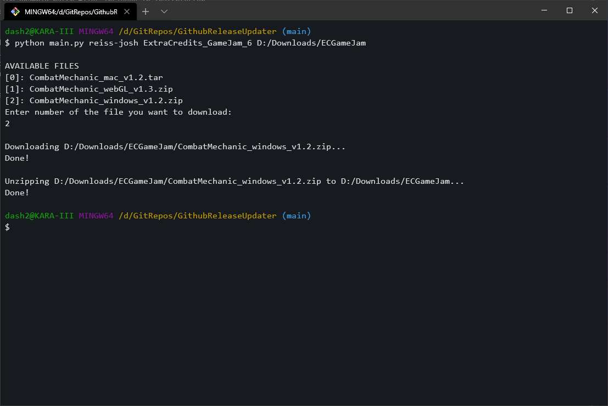

# GithubReleaseUpdater
This is a python command-line tool for downloading the newest Release from a GitHub repository.
It can be called like so:

```python
main.py <repo owner> <repo name> <destination (optional)> <your username (optional)>
```

If no command line arguments are provided, you can also use an interactive text input instead.

Here's an example of downloading my submission to the Extra Credits Game Jam 6:
| Command-Line | Interactive
| --- | --- |
|  | img src = <"img/noarg_example.png"> |

If the downloaded release is a .zip file, it will automatically be extracted, and the source .zip will be deleted.