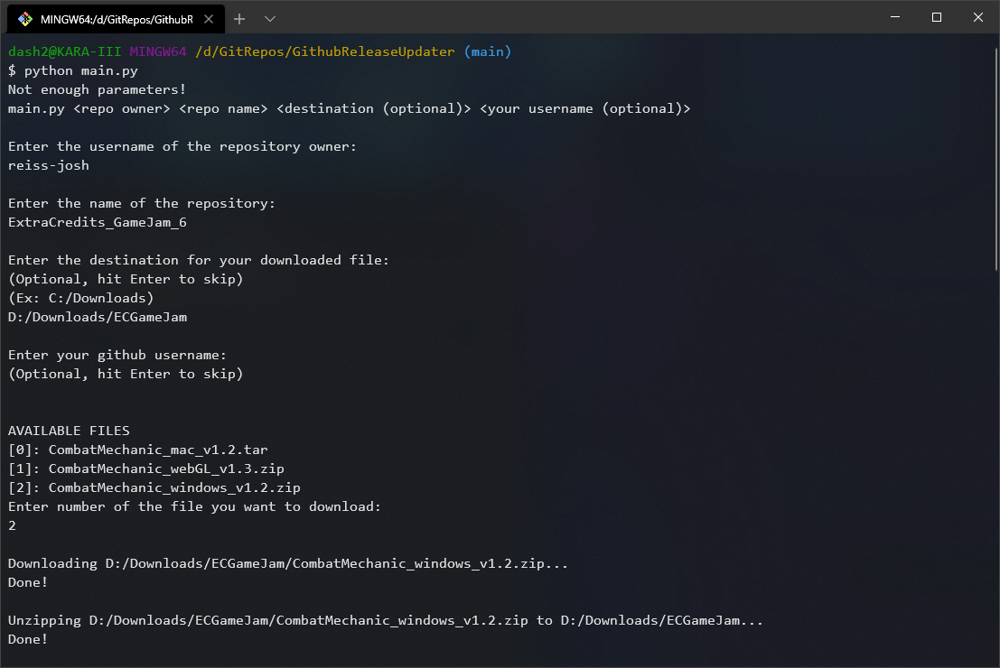

# GithubReleaseUpdater
This is a python command-line tool for downloading the newest Release from a GitHub repository.
It can be called like so:

```
main.py <repo owner> <repo name> <destination (optional)> <your username (optional)>
```

If no command line arguments are provided, you can also use an interactive text input instead.
If the downloaded release is a .zip file, it will automatically be extracted, and the source .zip will be deleted.

Here's an example of downloading my submission to the Extra Credits Game Jam 6:
| Command-Line | Interactive
| --- | --- |
|  |  |

There are two example batch files included in /batchtester.
If you place this the contents of this repository in a folder, you can use batchtester to make an easy installer for your github releases.

For example:
I could put this repo in a folder, then place a batch file with the following contents outside:
```@echo off
python ./main.py reiss-josh romset_cleaner "C:\Documents\Romset_Cleaner"
pause```
And I've suddenly created an easy installer for my romset_cleaner repository.